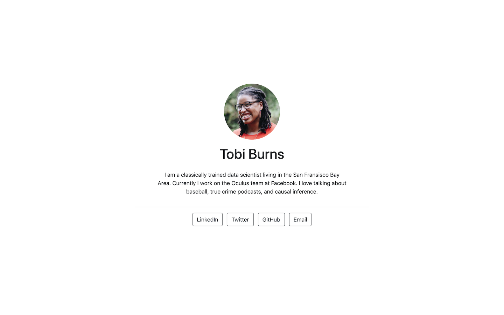

# shiftr

<!-- badges: start -->
<!--[](https://CRAN.R-project.org/package=postcards)
[](https://github.com/seankross/postcards/actions)-->
<!-- badges: end -->

Developed from [postcards package]("https://github.com/seankross/postcards"). **Original docs from [postcards]("https://github.com/seankross/postcards")**


# postcards

<!-- badges: start -->
[](https://CRAN.R-project.org/package=postcards)
[](https://github.com/seankross/postcards/actions)
<!-- badges: end -->

Create simple, beautiful personal websites and landing pages using only
R Markdown.

## Installation

You can install Postcards with the following command:

``` r
install.packages("postcards")
```

Or you can install the latest development version:

``` r
remotes::install_github("seankross/postcards@main")
```

## Getting Started

Postcards includes five templates:
[Jolla](https://seankross.com/postcards-templates/jolla/),
[Jolla Blue](https://seankross.com/postcards-templates/jolla-blue/),
[Trestles](https://seankross.com/postcards-templates/trestles/),
[Onofre](https://seankross.com/postcards-templates/onofre/),
and [Solana](https://seankross.com/postcards-templates/solana/).
Each site is optimized for being displayed on desktop and mobile.
The goal of the package is to make it easy for anyone to create a single page
personal website with one R Markdown document. I hope this package can quickly
demonstrate the power and possibilities of the R and R Markdown ecosystem to 
newcomers.

To get started customizing one of these templates you should create a new
project in RStudio. Once you open RStudio: select **File**, **New Project...**, 
then select **New Directory**, and **Postcards Website**. Then you will need to
enter a directory name for your RStudio project and you can choose one of the
templates from a drop down menu.
Select **Create Project** after you choose a name for the folder that will 
contain your site. This folder will contain two important files: an R Markdown 
document with your site's content, and a sample photo that you should replace.

If you are not using RStudio or if you do not wish to create a new RStudio 
project you can create the corresponding template files using the following 
commands:

``` r
#postcards::create_postcard(template = "shiftr")
```

To compile the self contained HTML file for your site, you can use the **Knit**
button in RStudio or you can use `rmarkdown::render("index.Rmd")`. 

The HTML file can then be easily deployed to 
[GitHub Pages](https://pages.github.com/) or
[Netlify Drop](https://app.netlify.com/drop).

## The Templates

### Jolla

<p align="center"></p>

```
---
title: "Tobi Burns"
image: "tobi.jpg"
links:
  - label: LinkedIn
    url: "https://linkedin.com/"
  - label: Twitter
    url: "https://twitter.com/"
  - label: GitHub
    url: "https://github.com/"
  - label: Email
    url: "mailto:email@email.com"
output:
  postcards::jolla
---
 
I am a classically trained data scientist living in the San Francisco Bay Area. 
Currently I work on the Oculus team at Facebook. I love talking about baseball, 
true crime podcasts, and causal inference.
```

## Troubleshooting

Most issues that people have using this package are related their installation
Pandoc, software that R Markdown relies on.
Currently Postcards works best with Pandoc version 2.8 or greater, although we
are working on better functionality for earlier versions of Pandoc. 
You can check which version of Pandoc you have installed with the following 
command:

```r
rmarkdown::pandoc_version()
```

If you have an earlier version of Pandoc installed we recommend you 
[install the latest version of Pandoc](https://pandoc.org/installing.html) and
then run the command:

``` r
rmarkdown::find_pandoc(cache = FALSE)
```

If you do not see that the new Pandoc version has been installed, you may need
to use RStudio and 
[install the latest preview release of RStudio](https://www.rstudio.com/products/rstudio/download/preview/).
If you are still encountering error messages after trying the above please open
an issue.

## Code of Conduct

Please note that the postcards project is released with a [Contributor Code of Conduct](https://contributor-covenant.org/version/2/0/CODE_OF_CONDUCT.html). By contributing to this project, you agree to abide by its terms.

